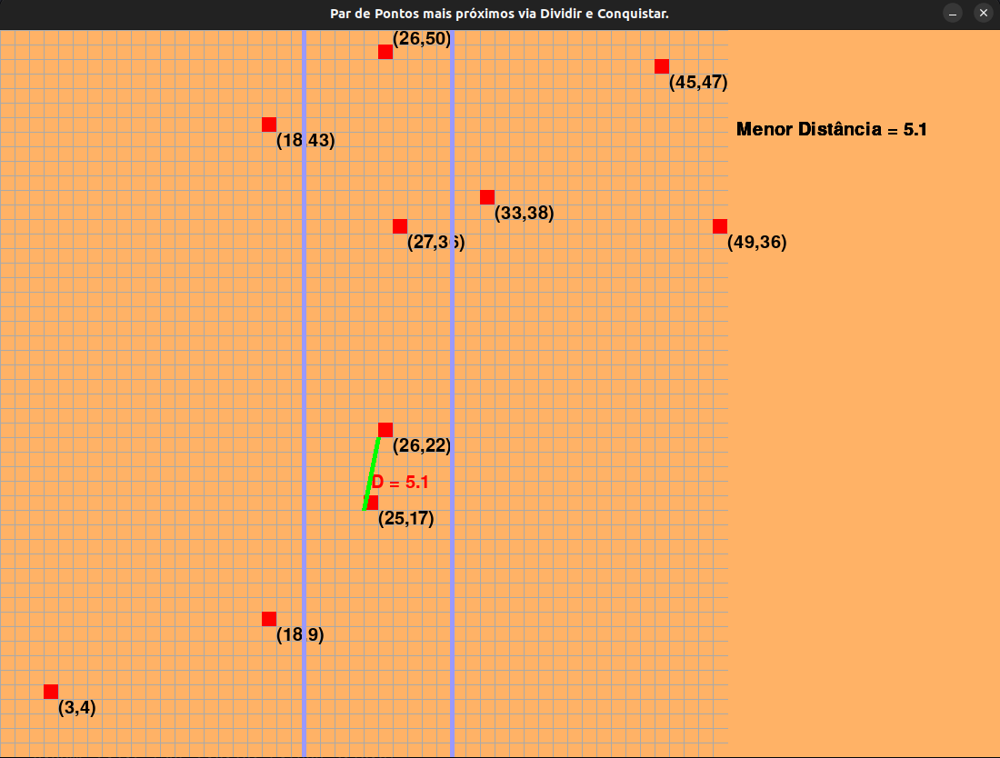

# DC_Dupla24_ClosestPairOfPoints

**Número da Lista**: 24<br>
**Conteúdo da Disciplina**: Dividir e Conquistar<br>

## Alunos
|Matrícula | Aluno |
| -- | -- |
| 18/0117548  |  [Bruno Carmo Nunes](https://github.com/brunocmo) |
| 17/0150747  |  [Marcos Vinícius Rodrigues da Conceição](https://github.com/marcos-mv) |
## Video

https://www.youtube.com/watch?v=4tZtZ8WYYX8

## Sobre
A ideia do projeto é simulador usando pygame onde dado uma lista de pontos é aplicado o algoritmo para encontrar a menor distância entre dois pontos utilizando a técnica de dividir e conquistar.



## Instalação
**Linguagem**: python<br>

Feito e usado no kernel: **Linux 6.0.10-arch2-1 x86_64**

Tenha o *git*, pyhton 3 e o pygame instalado na sua máquina.

caso não tenha o pygame na sua máquina instale

```
pip install pygame
```

Para clonar:

```
git clone https://github.com/projeto-de-algoritmos/DC_Dupla24_ClosestPairOfPoints.git
```

Para executar o programa:

```
pyhton3 main.py
```

## Uso

Caso exista interesse de testar com pontos que não sejam aleatórios, basta entrar no arquivo `points.py` e comentar a primeira função e descomentar a segunda com os pontos que deseja.
